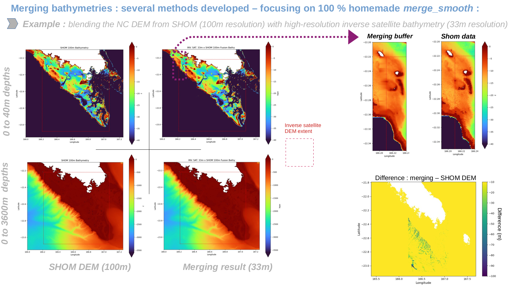

===============================================
Tutorial: How to Use merge_topo Functions
===============================================

Introduction
============
The script ``merge_topo.py`` contains various functions aimed at merging bathymetric datasets with different resolutions. Bathymetric data should be in NetCDF or TIF format.

merge_smooth
=============
Merges and smooths high and low-resolution grids, filling missing values (NaN) with interpolated data and blending the grids.

The function:
1. Prepares the coordinate grid for interpolation based on the high-resolution data.
2. Creates a buffer around the high-resolution grid and applies linear weighting in the overlapping areas.
3. Interpolates NaN values within the buffer using the low-resolution grid.
4. Fills the remaining NaNs with LOESS interpolation.
5. Saves the result as a NetCDF file.

This function can be applied to multiple grids at once via the ``merge_multiple_grids`` function, which merges grids from the finest to the coarsest.

.. note::
   To detect coordinate names, the function ``find_coords`` is used. This function identifies the names of longitude and latitude coordinates within a given dataset (ds). 
   It checks for common variations of longitude and latitude, such as 'lon', 'longitude', and 'x' for longitude, and 'lat', 'latitude', and 'y' for latitude, including cases where additional characters may be appended to these names (e.g., 'longitude025').

For interpolating the grids (necessary for grids with varying resolutions), the function ``interpolate_large_grid`` is available, which uses a chunking strategy to avoid memory overload.

The function **`create_depth_grid_from_points`** generates a 2D grid of interpolated depth values from depth data points. It reads the data from a text file, filters it based on latitude and longitude bounds, and uses cubic triangulation interpolation to create the grid. The grid is then masked to exclude areas outside the defined geographical boundaries.  
This function is used as an option within the **`merge_smooth`** function when the high-resolution file is a points file (e.g., `.xyz`).

.. attention::
   **Function still under development**: The interpolation method of ``create_depth_grid_from_points`` is currently **unsatisfactory** if the points are **sparse**.

Example of `merge_topo` use with a 30-cell buffer for a low-resolution grid from SHOM (~100m resolution) and a high-resolution grid computed from inverse satellite data (~33m resolution, J. Lefevre).

kring_merging
=============
Merges high-resolution and low-resolution bathymetric data using a kriging interpolation method while masking terrestrial areas based on a given shapefile.

⚠️ **Both high and low-resolution bathymetric files must be georeferenced in the same CRS/ESPG as defined by 'target_epsg'**.

mblend_smoothing
================
Python command lines for creating a temporary GRASS dataset and running the ``r.mblend`` addon over high/low resolution grids.  
More information: `https://grass.osgeo.org/grass84/manuals/addons/r.mblend.html`

Mblend: The DEM merging method proposed by Leitão et al. (2016). It deals with cases where a study area is only partially covered by a high-resolution DEM, with a coarser DEM available for the remainder (as shown below). The ``r.mblend`` method merges the two DEMs, producing a smooth transition from the high-resolution DEM to the low-resolution DEM.

Requires the installation of the mblend GRASS plugin.

⚠️ **This is a test function still under development**: Please be cautious, as it modifies the entire grid extent, and some options still need to be configured.