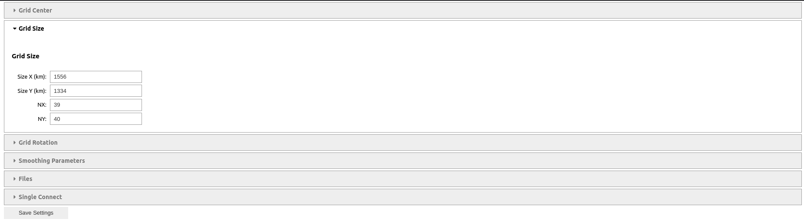
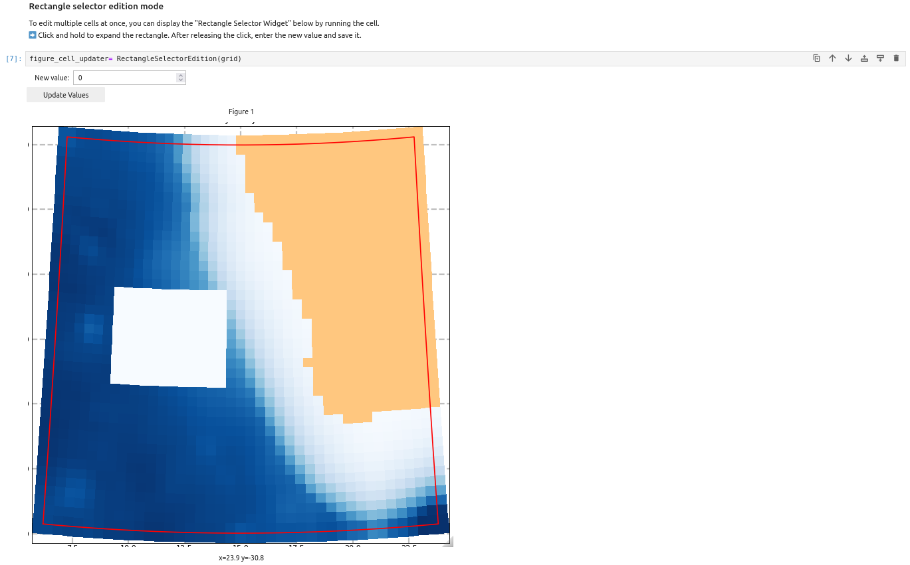
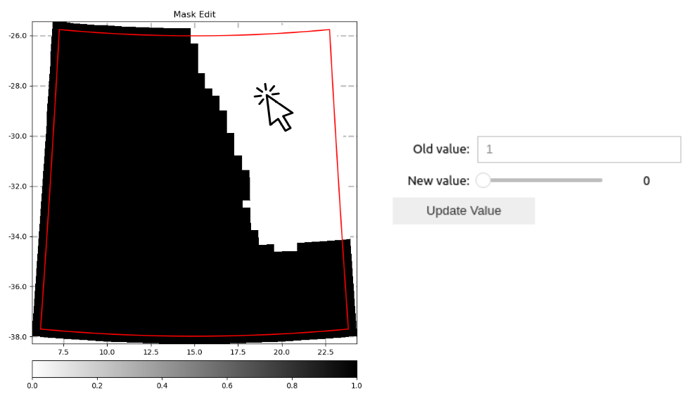
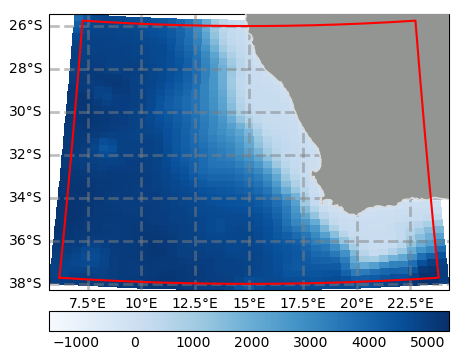

===============================================
Tutorial: How to Use make_grid Jupyter Notebook
===============================================

Introduction
============
The first step in creating a configuration is to build the grid for the region of interest. 
Subsequent steps, such as defining initial and boundary conditions, depend on the grid and use the CROCO grid file.
To create a grid, you can use the ``make_grid.py`` script for terminal execution (with or without the GUI) or the ``make_grid.ipynb`` notebook for a lighter Jupyter interface. Additionally, you can refer to ``tuto.grid.rst`` for technical explanations about the wrapped functions.

This tutorial explains the purpose of each section in the notebook and guides the user on how to use it effectively.

### Prerequisites
- Install the required Python libraries listed in ``environment_requirements.txt``

Description of make_grid's notebook
^^^^^^^^^^^^^^^^^^^^^^^^^^^^^^^^^^^
The ``make_grid.ipynb`` notebook helps you build your configuration grid over the area of interest. It performs the following steps:

* Place and define the grid around the chosen location
* Interpolate the bathymetry onto the CROCO grid
* Build the landmask
* Edit the landmask and bathymetry manually to modify artifacts
* Smooth the bathymetry based on the chosen criteria

.. note::

   This notebook is designed for creating grids on remote computers, such as HPC clusters, where the classic graphic interface might be slow, especially when using a VPN.

✅📋 Dependencies
===========================
The first cell activates the required backend environments and configures the import paths for modules, readers, and widget tools.
It also loads the CROCO functions/methods necessary for running widgets and for editing and smoothing the grid.

✏️🔧 User's Changes
===========================
Fill in the drop-down menu with the desired grid parameters and input file paths. 
Once the menu is filled, be sure to click the "Save" button to save your settings.

   This image shows the drop-down grid menu where users can select parameters and file paths for the grid generation.

🔎 Input Files
===========================
You will need the following input data files:

.. table:: Input Files Description
   :widths: 25 25 25
   :align: center
   :header-rows: 1

   * **Data**: Topography/Bathymetry
   * **Source**: etopo (5,2,1), SRTM30, GEBCO
   * **File Extension**: NetCDF
   
   * **Data**: Coastline
   * **Source**: GSHHS
   * **File Extension**: Shapefile

### Building the Grid
===========================
Executing this cell will launch the grid generation process based on the input parameters selected in the drop-down menu.

➡️ **Note**: The inputs are saved in a namelist called `config_grid.ini`, which you can use again with ``make_grid.py`` if needed.

Output cell: A summary of all the grid parameters, including the minimum and maximum longitude/latitude.

✏️ Mask and Bathymetry Editing
=============================

After launching these cells, you can zoom in on the mask/bathymetry grid and select cells one by one using the pointer or multiple cells using a rectangular selector. 
Click "Update Value" to save the modification. If you want to use this tool multiple times, re-launch the cell after each update.

### Editing Bathymetry
Example of bathymetry editing using a rectangular selector.

This image shows how to use the rectangular selector to edit the bathymetry.

### Editing the Mask
Example of landmask editing using the pointer (one cell at a time).

   
This image shows how to use the pointer tool to edit the landmask one cell at a time.

### ⛰️ Last Smoothing After Edits
===========================
After editing, apply the final smoothing based on the landmask to ensure that the bathymetry edits respect the smoothing coefficient (default: 0.2). 
The smoothing coefficients are printed as output so you can check if the criteria are respected.

👁️🌐 Grid Display
===========================
Visualize your grid using the `plot_grid` function with the following options:

plot_grid(outputs, figure, ax, shp_file, zview='grid outline', plot_shape=True)

**Arguments**:
1. **outputs**: The outputs of the grid generation process (e.g., grid data or results).
2. **figure**: The figure object for plotting (typically created using `matplotlib`).
3. **ax**: The axis object on which to plot the grid (also from `matplotlib`).
4. **shp_file**: Path to the shapefile that will be overlaid on the grid. This could be a coastline or other geographical features.
5. **zview**: A string that determines the type of visualization you want. You can choose one of the following options:
   - **'grid outline'**: Display the grid's outline.
   - **'grid points'**: Display the individual grid points.
   - **'topo'**: Display the topography data.
   - **'1/pm'**: Display the inverse of the grid cell size (1/pm), which might be used for visualizing grid resolution.
   - **'1/pn'**: Display the inverse of the node spacing (1/pn).
   - **'angle'**: Display the angles between the grid lines, useful for visualizing the grid's orientation.
   - **'mask'**: Display the mask, which is useful for showing areas of land or sea in the grid.
   
6. **plot_shape**: A boolean (True/False) that controls whether the shapefile will be plotted on the grid. 
   - Set to **True** to plot the shapefile over the grid.
   - Set to **False** to omit the shapefile.

Example of plotting the topography map with the grid outline:

This is an example of plotting the topography map with the grid outline.

💾 Save Grid as NetCDF
===========================
Once your grid is ready, you can save the CROCO grid as a NetCDF file, including the corresponding metadata.